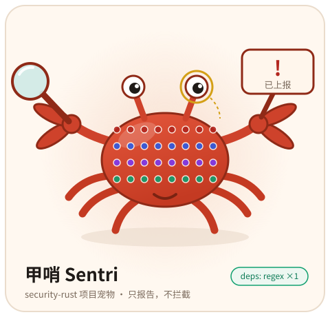
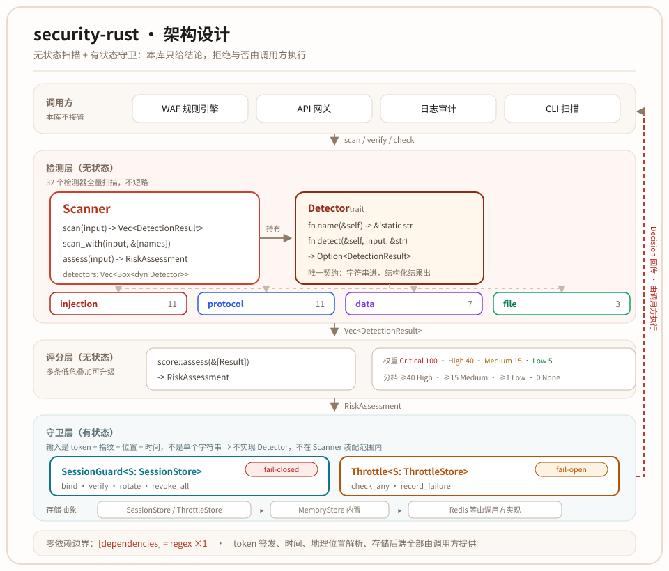
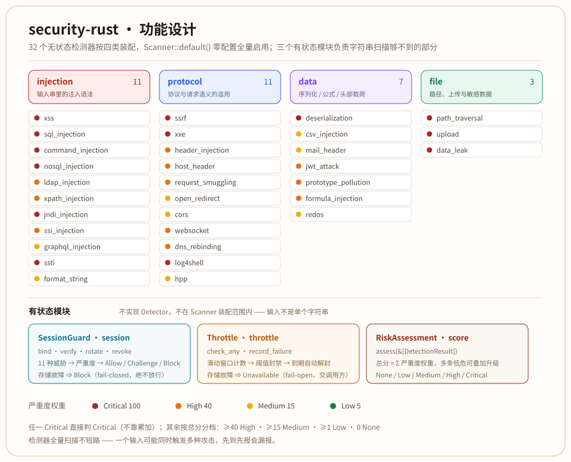
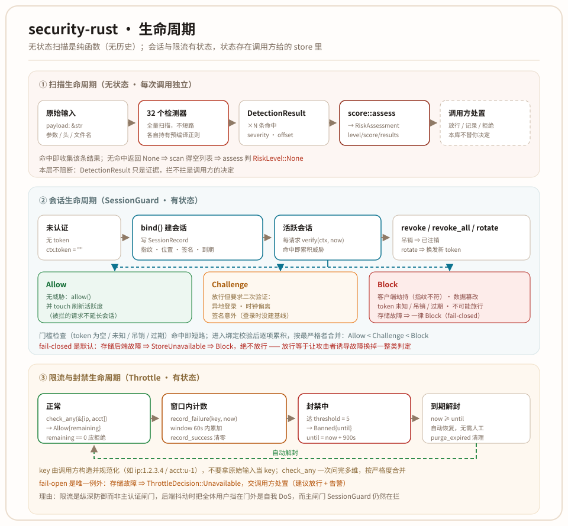

<!-- Copyright (c) 2026 erik <erik@erik.xyz> — https://erik.xyz -->

# security-rust

**🌐 Language:** [English](./docs/i18n/en/README.md) · [한국어](./docs/i18n/ko/README.md) · [Русский](./docs/i18n/ru/README.md) · [Deutsch](./docs/i18n/de/README.md) · [Français](./docs/i18n/fr/README.md) · [Español](./docs/i18n/es/README.md) · [Português](./docs/i18n/pt/README.md) · [हिन्दी](./docs/i18n/hi/README.md) · [العربية](./docs/i18n/ar/README.md) · [বাংলা](./docs/i18n/bn/README.md) · [Bahasa Indonesia](./docs/i18n/id/README.md) · [日本語](./docs/i18n/ja/README.md)

Rust 编写的攻击检测库，覆盖注入攻击、协议攻击、数据/序列化攻击、文件/敏感数据泄露 4 大类共 32 个检测器；另提供会话安全、限流封禁、风险评分三个有状态安全模块。零外部框架依赖，`[dependencies]` 只有 `regex`。

项目宠物 **甲哨 Sentri**（[`docs/pet.svg`](./docs/pet.svg)）—— 32 片甲片对应 32 个检测器，只报告，不拦截。

---

## 项目宠物：甲哨 Sentri



一只举着放大镜与告示牌的哨蟹。人设不是装饰，是把本库的设计画出来了：

| 形象 | 对应设计 |
|------|---------|
| 甲壳上 4 行 × 8 片甲片 | 32 个无状态检测器；4 行 = 注入 / 协议 / 数据 / 文件四大类 |
| 左钳的放大镜 | 负责**看** —— `Detector::detect()` 只做扫描，命中就返回一条证据 |
| 右钳的告示牌（`已上报`） | 负责**报** —— 返回 `DetectionResult`，不抛异常、不打断调用链 |
| 钳子从不夹人 | 判定权在调用方；唯一例外是 `SessionGuard`，它是真的会 `Block` |
| 单片镜 | 审计员的职业病：每条结论都带 `matched_pattern` 与 `offset`，能落到原文位置 |
| 铭牌上的 `deps: regex ×1` | 零依赖承诺：`[dependencies]` 永远只有 `regex` |

座右铭：**只报告，不拦截。**

形象以 `include_str!` 打进库里（零运行时开销，不用就不链接），ASCII 版可直接打进终端或日志：

```rust
println!("{}", security_rust::pet::ASCII);
```

---

## 项目结构

```
security-rust/
├── src/
│   ├── lib.rs              Detector trait（唯一契约）、regex_detect 辅助、crate 文档
│   ├── scanner.rs          Scanner / ScannerBuilder：默认装配 32 个检测器
│   ├── result.rs           DetectionResult / AttackCategory / Severity
│   ├── score.rs            风险评分：权重累加 + 分档 → RiskAssessment
│   ├── pet.rs              项目宠物形象（NAME / TAGLINE / ASCII / SVG）
│   ├── injection/          11 个注入类检测器
│   ├── protocol/           11 个协议类检测器
│   ├── data/               7 个数据类检测器
│   ├── file/               3 个文件类检测器
│   ├── session/            SessionGuard + SessionStore（guard / store / geo）
│   └── throttle/           Throttle + ThrottleStore（guard / store）
├── tests/                  7 个集成测试套件：会话、限流、生命周期、不变量、鲁棒性、端到端、多维限流
├── examples/
│   ├── waf.rs              端到端流水线示例（扫描 → 限流 → 会话 → 处置）
│   └── axum_middleware.rs  axum 中间件接入参考
├── docs/
│   ├── API.md              完整 API 参考
│   ├── OWASP-COVERAGE.md   与 OWASP 各类攻击的覆盖对照
│   ├── pet.svg             项目宠物形象
│   ├── diagrams/           架构 / 功能 / 生命周期三张图（SVG）
│   ├── i18n/               12 语言 README 与 API 文档
│   └── ...                 打赏码、代码评审与测试报告
└── Cargo.toml              唯一的运行时依赖：regex
```

---

## 设计思路

### 为什么用「检测」而非「拦截」

32 个检测器定位为**纯输入扫描器**——接收字符串，返回结构化检测结果，不绑定任何 Web 框架，不做 HTTP 请求/响应解析。这样你可以把它嵌入到任何链路中：WAF 规则引擎、日志审计、API 网关前置校验、CLI 安全扫描工具等。

会话安全（`session`）与限流封禁（`throttle`）是**有状态、身份相关**的，因此与检测器分开：它们要读写的输入是「token + 指纹 + 位置 + 时间」这类复合值，还要访问存储后端，`Detector::detect(&str)` 表达不了，所以**不实现 `Detector` trait**。两者的共同点仍是「不替你拦截」——`session` 给处置建议、`throttle` 给额度与封禁状态，是否拒绝请求由调用方决定。

### 架构原则

- **单一职责** — 每个检测器只管一种攻击类型，内部持有编译好的正则模式集
- **统一接口** — `Detector` trait 是所有检测器的唯一契约：`fn detect(&self, input: &str) -> Option<DetectionResult>`
- **默认覆盖** — `Scanner::default()` 一键装配全部 32 个检测器，零配置可用
- **可选配置** — `Scanner::builder()` 支持按需定制，通过 `.with_detector()` 选择性装配检测器
- **状态外置** — `session` / `throttle` 用 `SessionStore` / `ThrottleStore` trait 抽象存储，多实例部署实现该 trait 接 Redis 即可，库自身不绑定任何后端
- **零新增依赖** — `[dependencies]` 始终只有 `regex = "1"`：token 与签名由调用方提供，位置由调用方解析
- **fail-closed 是默认，例外要说明理由** — `SessionGuard` 在存储后端故障时返回 `Decision::Block`，绝不放行；`Throttle` 是唯一例外，故障时返回 `Unavailable` 交调用方处置

### 权衡

| 决策 | 选择 | 理由 |
|------|------|------|
| 正则 vs 解析器 | 正则 | 检测场景下速度优先，正则对变形/绕过模式的覆盖更好 |
| 先到先报 vs 全量检测 | 全量检测 | 一个输入可能同时触发多种攻击，不应漏报 |
| 零依赖 vs 引入 serde | 零依赖 | `[dependencies]` 只有 `regex`，编译快、体积小 |
| 检测器 vs 有状态模块 | 分开 | `Detector::detect(&str)` 只有字符串入参，表达不了「token + 指纹 + 位置 + 时间」的复合输入，`session` / `throttle` 因此独立于 `Scanner` |
| fail-closed vs fail-open | 认证 fail-closed，限流 fail-open | 会话判定放行等于被绕过，必须阻断；限流挡全体用户是自我 DoS，且主认证闸门仍在拦，处置权交调用方 |

---

## 设计架构



五层自上而下：**调用方**（WAF / 网关 / 审计 / CLI）→ **检测层**（`Scanner` 持有 `Vec<Box<dyn Detector>>`，四大类共 32 个）→ **评分层**（`score::assess`）→ **守卫层**（`SessionGuard` / `Throttle`，各自绑定一个 store trait）→ **存储抽象**（内置 `MemoryStore`，Redis 由调用方实现）。

`Detector` trait 是检测层唯一的契约：`fn detect(&self, input: &str) -> Option<DetectionResult>`。`session` / `throttle` / `score` 不实现它 —— 它们要么输入不是单个字符串（token + 指纹 + 位置 + 时间），要么消费的是扫描结果而非原始输入，因此各自独立作答（详见下节）。图中右侧那条红色回传线是本库的边界：**判定结果交回调用方执行**，库自己不碰请求。

### 模块职责

| 模块 | 路径 | 检测器数 | 职责 |
|------|------|---------|------|
| 核心 | `src/lib.rs` `result.rs` `scanner.rs` | — | `Detector` trait、`DetectionResult`、`Scanner`/`ScannerBuilder` |
| 注入 | `src/injection/` | 11 | XSS、SQL 注入、命令注入、NoSQL、LDAP、XPATH、JNDI、SSI、GraphQL、SSTI、格式串注入 |
| 协议 | `src/protocol/` | 11 | SSRF、XXE、Header 注入、Host 头攻击、请求走私、开放重定向、CORS、WebSocket、DNS 重绑定、Log4Shell、HTTP 参数污染 |
| 数据 | `src/data/` | 7 | PHP 反序列化、CSV 公式注入、邮件头注入、JWT 攻击、原型污染、表格公式注入、ReDoS |
| 文件 | `src/file/` | 3 | 路径遍历、恶意文件上传、敏感数据泄露 |
| 会话 | `src/session/` | — | `SessionGuard`：客户端劫持、数据篡改、异地登录 / 不可能旅行、token 会话绑定与吊销 |
| 限流 | `src/throttle/` | — | `Throttle`：滑动窗口计数、阈值封禁、账户锁定 |
| 评分 | `src/score.rs` | — | `RiskAssessment`：把多条低危命中聚合成可观测量 |

`session` 与 `throttle` 是**有状态**的，不对应任何检测器：它们不在 `Scanner` 的装配范围内，也不能用 `scan()` 调用。

### 检测结果结构

`DetectionResult` 结构化返回 `attack_type`、`category`、`severity`、`matched_pattern`、`offset`、`message` 六项字段。`Scanner::assess()` 在此之上给出聚合后的风险等级（`RiskAssessment`）。完整定义见 [API 参考](./docs/API.md)。

---

## 实现功能



32 个检测器按四大类装配，`Scanner::default()` 零配置全量启用；下表逐个列出各自覆盖的攻击模式与严重度。严重度只描述单条命中的危害，聚合后的整体风险看 `Scanner::assess()`。

### 注入类攻击（11 个检测器）

| 检测器 | 覆盖模式 | 严重度 |
|--------|---------|--------|
| **xss** | `<script>`、`onerror=` 等事件处理器、`javascript:` 伪协议、`<svg>`/`<iframe>` 标签、CSS `expression()`、`eval()`、`document.cookie` | Critical |
| **sql_injection** | `UNION SELECT`、`sleep()`/`benchmark()`/`pg_sleep()` 延时注入、`information_schema` 枚举、`exec sp_`/`xp_` 存储过程、布尔盲注模式 `' OR '1'='1`、`LOAD_FILE()`/`INTO OUTFILE` | Critical |
| **command_injection** | 反引号命令、`$()` 子命令、管道符链式执行、`/dev/tcp` 反弹 shell、`passthru()`/`shell_exec()`/`system()` PHP 函数、`cmd.exe`/`powershell` 调用 | Critical |
| **nosql_injection** | MongoDB `$ne`/`$gt`/`$regex`/`$where` 操作符、`$or` 注入、认证绕过 `{"$gt": ""}` | Critical |
| **ldap_injection** | `(&` `(\|` `(!` 过滤操作符、`*(cn=` 属性枚举、`objectClass`/`uid` 注入 | High |
| **xpath_injection** | `' or '1'='1` 布尔绕过、`' or true()` 函数注入、`'] \| '` 节点遍历 | High |
| **jndi_injection** | `${jndi:ldap://`、`${lower:j}` 混淆、`${upper:j}` 混淆、`${::-j}` 空字符串混淆、`${env:}` 环境变量查找、`${sys:}` 系统属性 | Critical |
| **ssi_injection** | `<!--#exec cmd=` 命令执行、`<!--#include file=` 文件包含、`<!--#echo var=` 变量输出、`<!--#fsize`/`<!--#flastmod` 文件信息 | High |
| **graphql_injection** | `__schema`/`__type` 内省查询、深度嵌套 DoS（≥5层） | Medium |
| **ssti** | Jinja2 `{{ }}` / FreeMarker `${ }` **定界符内的求值**（`{{7*7}}`、`${7*7}`、`{{config`、`${T(java.lang.Runtime)}`）、ERB `<%=` `<%@`、Velocity `#set()`、Python 逃逸链 `__mro__`/`__subclasses__()`/`__globals__`/`__builtins__`/`__class__`/`__dict__`；定界符本身不是信号，`${x}` 这类纯占位符不报 | Critical |
| **format_string** | `%n`/`%hn`/`%1$n` 内存写入转换符、`%99999999d` 超宽宽度炸弹、`%x%x%x`/`%p%p%p` 连续读栈、`%08x.%08x` 带分隔泄露、连续 4 个以上 `%s` 逐栈读取；单个 `%s`/`%d` 属正常占位符不报 | Medium |

### 协议与请求攻击（11 个检测器）

| 检测器 | 覆盖模式 | 严重度 |
|--------|---------|--------|
| **ssrf** | `169.254.169.254` 云元数据、RFC1918 内网 IP（10.x、172.16-31.x、192.168.x）、`127.x` loopback、`::1` IPv6 loopback、`0.0.0.0`、`gopher://`/`dict://`/`ftp://`/`file://` 危险协议 | Critical |
| **xxe** | `<!ENTITY` 实体声明、`SYSTEM`/`PUBLIC` 外部引用、`%` 参数实体、`<!DOCTYPE` DTD 声明 | Critical |
| **header_injection** | `%0d%0a` URL 编码 CRLF、`\r\n` 原始 CRLF 注入 | High |
| **host_header** | 多 Host 头注入、`X-Forwarded-Host`/`X-Original-URL`/`X-Rewrite-URL` 投毒、CRLF 携带 Host | High |
| **request_smuggling** | 双重 `Transfer-Encoding` 头、`Content-Length: 0` 走私、`\r\n0\r\n` chunked 终止混淆 | High |
| **open_redirect** | `//evil.com` 协议相对 URL、`javascript:`/`data:text/html` 伪协议跳转 | Medium |
| **cors** | `Access-Control-Allow-Origin: null`、`Origin: null`（沙箱 iframe 与 CSWSH 的规范指示符）、`Access-Control-Allow-Origin: *` 与 `Access-Control-Allow-Credentials: true` **同现**。两者单独出现是公开 API 与静态资源的常态，不报 | Medium |
| **websocket** | `Origin: null` 与 WebSocket 升级（`Upgrade: websocket`）同现（CSWSH）、`ws://` 指向环回 / 私网 / 链路本地地址（含云元数据端点 `169.254.169.254`） | High |
| **dns_rebinding** | Host 头为 `127.x`/`10.x`/`192.168.x`/`172.16-31.x` 内网 IP、`localhost`、`::1`、`0.0.0.0` | High |
| **log4shell** | `${lower:j}`/`${upper:J}` 单字符大小写折叠、`${::-j}` 前缀折叠、`${env:…}ndi:` 等 lookup 展开后才拼出 JNDI（载荷不含 `jndi` 字面量）、`${${lower:…}}` 嵌套展开、`%24%7Blower%3Aj%7Dndi` URL 编码绕过 | Critical |
| **hpp** | 同名参数重复（`?id=1&id=2`）、`&` 与 `;` 分隔符混用（`?a=1&b=2;c=3`，两层解析器得出不同的参数个数）；`;jsessionid=` 矩阵参数属路径分隔符，被排除 | Medium |

### 数据与序列化攻击（7 个检测器）

| 检测器 | 覆盖模式 | 严重度 |
|--------|---------|--------|
| **deserialization** | PHP `O:数字:`/`C:数字:` 序列化对象、`a:数字:{` 数组、`unserialize()` 调用、`__wakeup`/`__destruct`/`__toString` 等魔术方法 | Critical |
| **csv_injection** | 行首 `=`/`+`/`-`/`@` 公式字符（制表符与回车是**分隔符**，不是公式起始）、分隔符 `,`/`;`/`\t` 之后紧跟非空白的 `=`（TSV/CSV 第二个单元格里的公式）、DDE 动态数据交换、`cmd\|` 命令管道、`@SUM()` 函数 | Medium |
| **mail_header** | `Bcc:`/`Cc:` 密送注入、`From:` 多重发件人、`MIME-Version:`/`Content-Type: multipart` MIME 头注入、`boundary=` 边界操纵 | Medium |
| **jwt_attack** | `alg: none` 空算法绕过、`kid` 路径遍历注入、空签名段、空 payload 段 | High |
| **prototype_pollution** | `__proto__`/`constructor.prototype` 原型链污染、`__defineGetter__`/`__defineSetter__`/`__lookupGetter__`/`__lookupSetter__` 属性劫持 | High |
| **formula_injection** | `=cmd\|' /C calc'!A0` 命令管道、`HYPERLINK()`/`IMPORTXML()`/`IMPORTDATA()`/`WEBSERVICE()`/`RTD()`/`EXEC()` 等外带数据函数、`=rundll32\|…!A0` 任意二进制 + DDE 单元格引用、`DDE(` 载荷、legacy `@SUM(` 前缀公式。只报能执行命令或外带数据的载荷（High），纯算术公式 `=SUM(A1:A5)` 归粗粒度层 **csv_injection**（Medium） | High |
| **redos** | 量词套量词 `(a+)+`/`(a*)*`/`(.+)+`、量词套有界重复 `(a+){2,}`、无界重复套量词 `(a{2,})*`、重叠分支 `(.\|x)+`/`(\d\|\w)*`、空分支 `(x\|)*`、同前缀分支 `(a\|ab)*`。防御方视角：把用户输入当正则编译前先扫一遍 | Medium |

### 文件与敏感数据（3 个检测器）

| 检测器 | 覆盖模式 | 严重度 |
|--------|---------|--------|
| **path_traversal** | `../`/`..\\` 目录跨越、`%2e%2e` URL 编码绕过、`php://filter`/`php://input`/`phar://`/`zip://`/`data://`/`expect://`/`glob://` 协议包装器、`%00` 空字节截断 | Critical |
| **upload** | `<?php`/`<?=` PHP 标签、`<%@`/`<%=` ASP 标签、`eval($_`/`system($_`/`exec($_`/`passthru($_` 后门模式、`$_GET`/`$_POST`/`$_REQUEST`/`$_SERVER` 超全局变量、`base64_decode()` 编码绕过 | Critical |
| **data_leak** | 16 位信用卡 PAN（Visa/MasterCard/AmEx/Discover/JCB/Diners）、AWS Access Key `AKIA...`、PEM 私钥头 `-----BEGIN`、OpenAI/LLM API Key `sk-...`、数据库连接串 `mongodb://`/`mysql://`/`postgresql://`/`redis://`/`jdbc:`、JWT Token | Critical |

---

## 生命周期



三条生命周期互相独立，唯一的交汇点是调用方的请求处理函数：

| 生命周期 | 起点 | 终点 | 状态存放 |
|---------|------|------|---------|
| **扫描** | `Scanner::scan(&str)` | `Vec<DetectionResult>` → `score::assess` → `RiskAssessment` | 无状态，每次调用独立 |
| **会话** | `SessionGuard::bind()` 写 `SessionRecord` | 每请求 `verify()` → `SessionVerdict` ⇒ `Allow` / `Challenge` / `Block` | `SessionStore`（内置 `MemoryStore`） |
| **限流** | `Throttle::check_any(&[keys])` | `Allow{remaining}` / `Banned{until}` / `Unavailable` | `ThrottleStore`（内置 `MemoryThrottleStore`） |

两条容易踩的边界：

- **`remaining == 0` 表示本请求应被拒绝** —— 额度已耗尽，不是「还能再试一次」。要写进 `X-RateLimit-*` 时别写反。
- **存储故障的处置两边相反**：`SessionGuard` fail-closed（`StoreUnavailable` ⇒ `Block`，绝不放行，否则攻击者诱导故障就能换掉一整类判定）；`Throttle` fail-open（`Unavailable` 交调用方，后端抖动时把全体用户挡在门外是自我 DoS，主闸门 `SessionGuard` 仍在拦）。这是写死的设计，不是漏写的兜底。

---

## 使用说明

零配置即可使用：

```rust
use security_rust::Scanner;

let scanner = Scanner::default();
let results = scanner.scan("<script>alert('xss')</script>");
// [CRITICAL] XSS cross-site scripting detected — offset: 0, pattern: <script>
```

风险评分把命中列表汇成一个等级，避免多条低危信号被静默忽略：

```rust
let assessment = scanner.assess("=cmd|' /C calc'!A0 `cat /etc/passwd` ../../../etc/passwd");
// assessment.level   >= RiskLevel::High
// assessment.results >= 3
// assessment.score   — 原始加权分
```

完整 API 参考（安装、选择性扫描、自定义配置、风险评分、严重度展示、会话安全、限流与封禁、性能）见 [API 参考](./docs/API.md)。

### 会话安全（`session`）

```rust
use security_rust::session::{Decision, MemoryStore, RequestContext, SessionConfig, SessionGuard};

let guard = SessionGuard::new(MemoryStore::new(), SessionConfig::default());

let login = RequestContext {
    token: "tok-abc",
    subject: "u-1",
    fingerprint: "ip=1.2.3.4|ua=curl",   // 客户端指纹，登录时绑定
    location: Some("CN-BJ"),
    coords: Some((39.9042, 116.4074)),
    signature: None,                      // MAC 由调用方签发
    at: None,
};

// 登录：建会话 + 绑指纹 + 记位置；异地只影响 verdict，不阻断登录
guard.bind(&login, 1_700_000_000).unwrap();

// 每请求校验：同一个 token，换一个指纹 ⇒ 客户端劫持
let verdict = guard.verify(&RequestContext { fingerprint: "ip=5.6.7.8|ua=curl", ..login }, 1_700_000_010);

match verdict.decision {
    Decision::Allow => { /* 放行 */ }
    Decision::Challenge => { /* 放行但要求二次验证：异地、时钟偏离、签名意外 */ }
    Decision::Block => { /* 拒绝 */ }
}
```

### 限流与封禁（`throttle`）

```rust
use security_rust::throttle::{MemoryThrottleStore, Throttle, ThrottleConfig, ThrottleDecision};

let throttle = Throttle::new(MemoryThrottleStore::new(), ThrottleConfig::default());
let key = "acct:u-1"; // key 由调用方构造并规范化，不要直接拿原始输入当 key
let now = 1_700_000_000;

// 真实请求有两个维度：IP 与账户。check_any 一次问完，按严格度合并
match throttle.check_any(&["ip:1.2.3.4", key], now) {
    // remaining 可写进 X-RateLimit-*；**remaining == 0 表示本请求应被拒绝**
    ThrottleDecision::Allow { remaining } => { /* 剩余额度 remaining */ }
    // now >= until 即视为已解封
    ThrottleDecision::Banned { until } => { /* 封禁中，until 解封 */ }
    // 后端故障：本模块不替调用方做决定（建议放行 + 告警）
    ThrottleDecision::Unavailable => { /* 限流后端不可用 */ }
}

// 认证失败记一笔：达到 threshold 即封禁。返回 ThrottleOutcome（两态），
// 存储故障走 Err —— 不必为一个永不执行的 Unavailable 臂写死代码
let _ = throttle.record_failure(key, now);
```

---

## 开发

```bash
# 构建
cargo build --release

# 测试（494 个：365 单元 + 128 集成 + 1 文档测试）
cargo test

# 端到端流水线示例（扫描 → 限流 → 会话 → 处置）
cargo run --example waf

# 代码检查
cargo clippy -- -D warnings
```

---

## 打赏 / 赞助

如果这个项目对你有帮助，欢迎打赏支持（自愿）。

| 支付宝 | 微信支付 |
|--------|---------|
|  |  |

### 全球转账（国际汇款）

【收款人信息】
- 收款人姓名：WANG KEXUN
- 收款账户号码：881015918251

【收款银行】
- ZA Bank SWIFT Code：AABLHKHHXXX
- 银行名称：ZA Bank Limited
- 银行编号：387
- 银行地址：Core F, Cyberport 3, 100 Cyberport Road, Hong Kong

【跨境汇款代理银行（如需）】

请留意，此为跨境汇款代理银行（中转银行）信息，非收款银行信息。请向汇款银行查询是否需要提供跨境汇款代理银行信息。

汇入港元、人民币及美元的代理银行为 Citibank：
- 银行名称：Citibank N.A. Hong Kong
- SWIFT Code：CITIHKHXXXX
- 银行编号：006
- 分行名称：Hong Kong Branch
- 分行编号：391
- 银行地址：Citibank Tower, Citibank Plaza, 3 Garden Road, Central, Hong Kong

汇入其他币种时的代理银行为 BNY Mellon：
- 银行名称：THE BANK OF NEW YORK MELLON
- SWIFT Code：IRVTUS3NXXX
- 银行地址：THE BANK OF NEW YORK MELLON, 240 GREENWICH STREET, NEW YORK, United States

---

## 许可

MIT — Copyright (c) 2026 erik <erik@erik.xyz> — https://erik.xyz
